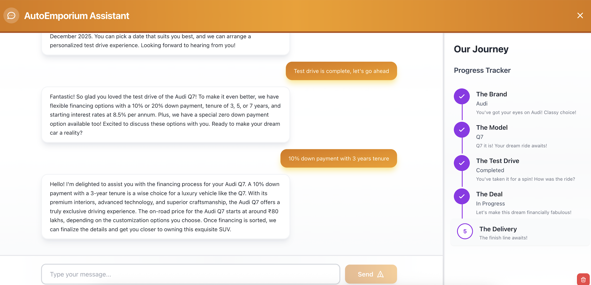

# Car Dealership Agent with Redis Agent Memory Server

Car dealership AI agent demonstrates how Redis Agent Memory Server enables long-term memory and conversation context retrieval, allowing the agent to remember customer preferences across sessions and provide personalized car purchase assistance.

## Table of Contents

- [Demo Objectives](#demo-objectives)
- [Setup](#setup)
- [Running the Demo](#running-the-demo)
- [Architecture](#architecture)
- [Resources](#resources)
- [Maintainers](#maintainers)
- [License](#license)

## Demo Objectives

- Demonstrate long-term memory storage using Redis Agent Memory Server
- Demonstrate short-term/working memory storage using LangGraph checkpointers and Redis Agent Memory Server
- Showcase conversation context retrieval for personalized interactions
- Show agentic orchestration with LangGraph workflow stages

## Setup

### Dependencies

- Python 3.11+
- Node.js 18+
- Docker (for running frontend and backend together)

### Configuration

Clone the repository:

```bash
git clone <repository-url>
cd dealership-chatbot-agent-memory-demo
```

Create a `.env` file in the project root:

```bash
OPENAI_API_KEY=your_openai_api_key_here
REDIS_URL=<redis-cloud-url>
MEMORY_SERVER_URL=http://localhost:8000
```

## Running the Demo





### 1. Agent Memory Server Setup

Get the Pre-built Docker Images from https://hub.docker.com/r/redislabs/agent-memory-server

Quick Start: Run the API Server (Requires Separate Redis)

```bash
docker run -p 8000:8000 \
  -e REDIS_URL=<redis-cloud-url> \
  -e OPENAI_API_KEY=your-key \
  redislabs/agent-memory-server:latest
```
Notes:
This command starts only the Agent Memory Server API. You must have a running Redis instance accessible at the URL you provide.
For more advanced configuration, see the full documentation: https://github.com/redis-developer/agent-memory-server

### 2. Docker Setup

```bash
# Start all services with Docker
docker-compose up --build

# Access the application
# Frontend: http://localhost:3000
# Backend: http://localhost:8001
```

## Architecture

**Workflow Orchestration (LangGraph)**: Manages conversation state and guides customers through the car purchase journey

**Short-Term Memory (Redis Agent Memory Server)**: Maintains working memory of the ongoing conversation

**Long-Term Memory (Redis Agent Memory Server)**: Semantic memory to stores customer preferences and conversation history across sessions

**Modern Frontend (React 18 + TypeScript + Tailwind)**: Beautiful, responsive dealership UI with full-page chatbot interface

### Architecture Flow

```
User Query
    ↓
[Retrieve Conversation Context] → Load past preferences from long-term memory
    ↓
[Parse Slots] → Extract car preferences using LLM
    ↓
[Ensure Readiness] → Check if all required slots are filled
    ↓
[Decide Next]
    ├→ Missing slots? → Ask follow-up question
    └→ All slots filled? → Advance to next stage
         ↓
    [Workflow Stages]
         ├→ Brand Selected? → Suggest Models
         ├→ Model Selected? → Suggest Test Drive
         ├→ Test Drive Completed? → Suggest Financing
         └→ Financing Discussed? → Prepare for Delivery
         ↓
    [Save to Memory] → Store conversation and preferences to working & long-term memory
         ↓
    Response to User
         ↓
    [UI Updates] → Update workflow visualization
```


## Resources

- [Redis Agent Memory Server](https://github.com/redis/agent-memory-server)
- [LangGraph Documentation](https://langchain-ai.github.io/langgraph/)
- [LangChain Documentation](https://python.langchain.com/)
- [FastAPI Documentation](https://fastapi.tiangolo.com/)

## Maintainers

Bhavana Giri — bhavanagiri

## License

This project is licensed under the MIT License.
